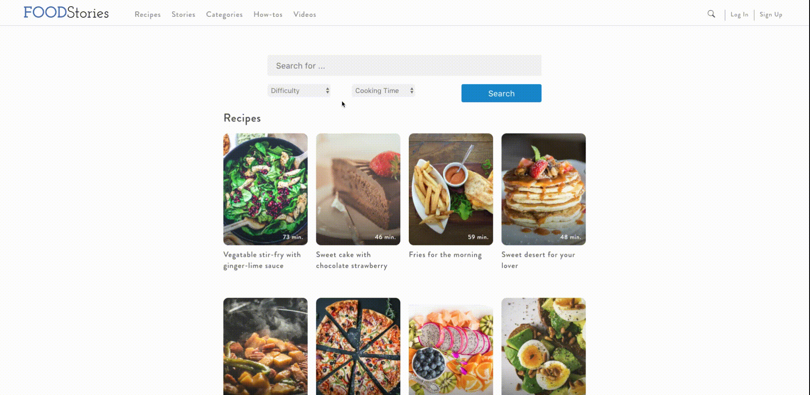
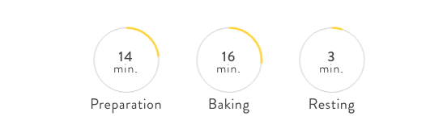

# Food Stories

[Live Demo](https://food-stories.herokuapp.com/)


**Food Stories** is a full-stack web application that is inspired by _Kitchen Stories_. The project is built entirely on Ruby on Rails backend and with React-Redux frontend.   

Different from the original web, Food Stories is a single-page web app. It only re-renders components instead of reloading the whole page every time user navigate to different routes.

The web app has user authentication including sign up, log in, log out functions. Beside that, users can explore the world of recipes, and stories about cooking created by other users and contributors. Each user has his or her abilities to search, like, comment and even share their own recipe posts.

## Current Features

### User authentication
The user authentication is built with BCrypt ruby gem technology. Therefore, there is a assurance to protect users' credentials information even when the log-in session is stored on the browser.


### Recipes
Food stories can display a wide list of recipes created by users. User can easily navigate through the list and view the one they are interested. Once they click on the list item, they will be provided with all information about the recipe such as difficulty, cooking time, ingredients and the cooking steps.   
Beside that, users can upload their food photos through the comment sections of the post. They also can like the post, and the recipe will be saved in the user's **Likes** page.


### Stories
This is another type of posts that user can enjoy reading while exploring the website. Stories are supposed to be written by contributors. Therefore, users cannot create their own story post. However, like and comment functions are also available here.


### Searching
This feature is built for better user's experience. They can search with title, difficulty and cooking time.



## Difficulties - Achievements
### React Cycle
To be able to finish the website, I had to spend hours to put myself familiar with the React cycle concept. Since most of the processes are asynchronous, it eventually will have unexpected behaviors. In order to resolve it, knowing when and which react cycle method to use becomes essential.  

_Here is one of the example, where I have to let component finishes the first render, then get canvas element to draw circles for cooking duration:_
```JavaScript
componentDidUpdate(prevProps) {
  if (this.props.recipe && this.props.recipe.ingredients) {
    const {preparation_min, baking_min, resting_min} = this.props.recipe;
    // We need canvasLoaded to only render canvas ONCE after first load
    if (!this.canvasLoaded) {
      Canvas.drawCanvas(preparation_min, baking_min, resting_min);
      this.canvasLoaded =  true;
    }
  }
}
```

### Canvas drawing
As mentioned above, canvas is the tool I needed to display cooking time on a recipe showpage. Two circles are drawn. The yellow circle is drawn based on the minute it takes. Full yellow circle means the time is more than 60 minutes:



```JavaScript
const drawMinute = (min, context) => {
  const percentage = min/60;
  const radian = 2 * Math.PI * percentage;
  context.beginPath();
  //Canvas arc note:
  //It draws clockwise as default.
  //The starting radian is based on the drawing direction.
  //Ex: If it draws clockwise and starting radian is Pi/2:
  //The starting position will be at 6'o clock.
  //For this one: we start at 3Pi/2 (12 o'clock position)
  const startingRad = 3/2 * Math.PI;
  const endingRad = startingRad + radian;
  context.arc(42.5, 42.5, 40, startingRad, endingRad);
  context.strokeStyle="#ffd11a";
  context.lineWidth *= 2.5; // double line width
  context.stroke();
};
```

### Sticky navigating bar switching
Making the navigation bar stick to the page is not difficult, but switching between them was a challenge for me. My way to solve this is using jQuery:


```JavaScript
stickyHandling() {
  const $header1 = $('#header1');
  if ($(window).scrollTop() >= 522.7272338867188) { // I got this by checking on window console
    $header1.addClass("hidden-header");
  } else {
    $header1.removeClass("hidden-header");
  }
  const $header2 = $('#header2');
  if ($(window).scrollTop() >= 585.4545288085938) { // I got this by checking on window console
    $header2.addClass("sticky-header");
  } else {
    $header2.removeClass("sticky-header");
  }
}
```

## Future Features
* **Videos**  
The original website has tons of videos embedded in the websites including How-to videos and Recipe videos. In the close future, I will let users upload their videos onto Food Stories.  

* **Tagging and Categories**  
With tags for each post, I can implement related posts so users can check other similar recipes. Furthermore, a good feature to have is sort all the posts into categories.

* **Infinite scroll**  
Infinite scroll has been used in many websites now. It is a cool features to have for Recipes and Stories pages.
