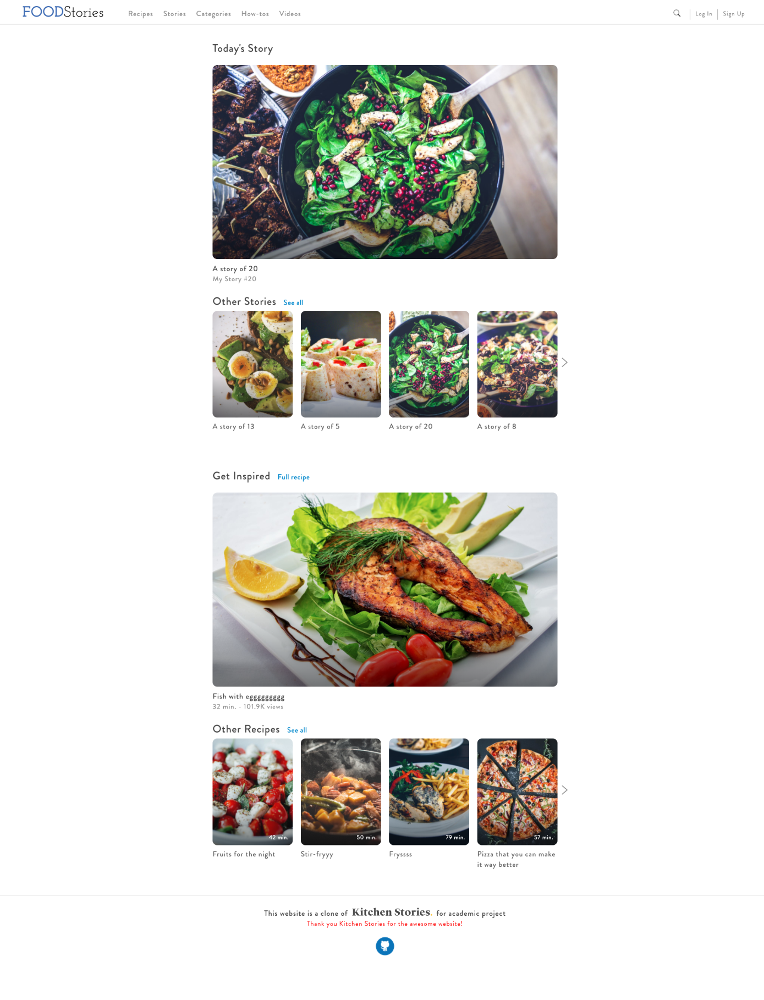
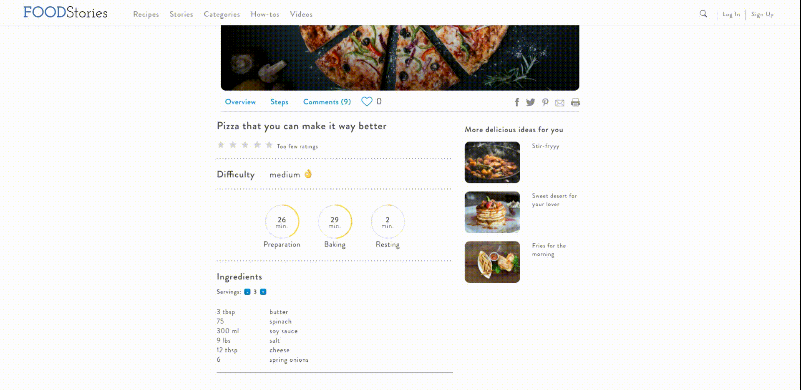

# Food Stories

[Live Demo](https://food-stories.herokuapp.com/)

Food Stories is a full-stack web application that is inspired by Kitchen Stories. The project is built entirely on Ruby on Rails backend and with React-Redux frontend.   

Different from the original web, Food Stories is a single-page web app. It only re-renders components instead of reloading the whole page every time user navigate to different routes.

The web app has user authentication including sign up, log in, log out functions. Beside that, users can explore the world of recipes, and stories about cooking created by other users and contributors. Each user has his or her abilities to search, like, comment and even share their own recipe posts.

## Current Features

### User authentication
The user authentication is built with BCrypt ruby gem technology. Therefore, there is a assurance to protect users' credentials information even when the log-in session is stored on the browser.

### Recipes
Food stories can display a wide list of recipes created by users. User can easily navigate through the list and view the one they are interested. Once they click on the list item, they will be provided with all information about the recipe such as difficulty, cooking time, ingredients and the cooking steps.   
Beside that, users can upload their food photos through the comment sections of the post. They also can like the post, and the recipe will be saved in the user's **Likes** page.

### Stories
This is another type of posts that user can enjoy reading while exploring the website. Stories are supposed to be written by contributors. Therefore, users cannot create their own story post. However, like and comment functions are also available here.

